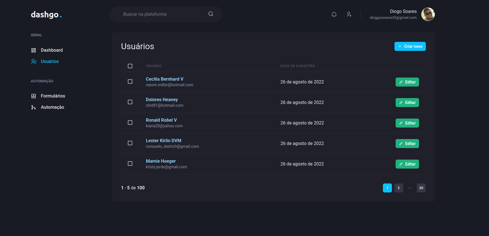

 

## 📄 Descrição

Projeto desenvolvido com intuito de criar um dashboard de usuários cadastrados e outras funcionalidades para fins de estudo.
Projeto feito com ReactJS, NextJS, Tanstack Query (antigo ReactQuery), ChakraUI, Miragejs

## 🛠 Technologies

![react][react] ![nextjs][nextjs] ![tanstackquery][tanstackquery] ![chakra ui][chakra] ![mirage js][miragejs]

## 📷 Screenshots

## 🦾 Sobre mim

[react]: https://img.shields.io/badge/react%20js-1E4174?style=for-the-badge&logo=react&logoColor=white&labelColor=81D8F7

[nextjs]: https://img.shields.io/badge/nextjs-1E4174?style=for-the-badge&logo=vercel&logoColor=white&labelColor=000000

[tanstackquery]: https://img.shields.io/badge/tanstack%20query-1E4174?style=for-the-badge&logo=reactquery&logoColor=white&labelColor=FF4154

[chakra]: https://img.shields.io/badge/chakra%20ui-1E4174?style=for-the-badge&logo=chakraui&logoColor=white&labelColor=49D0FF

[miragejs]: https://img.shields.io/badge/mirage%20js-05C77E?style=for-the-badge&logo=miragejs&logoColor=white&labelColor=05C77E

